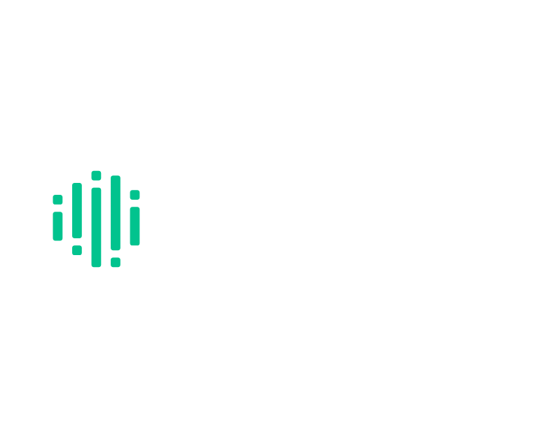
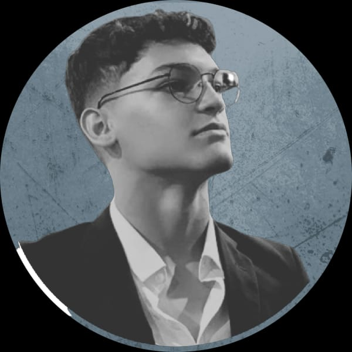
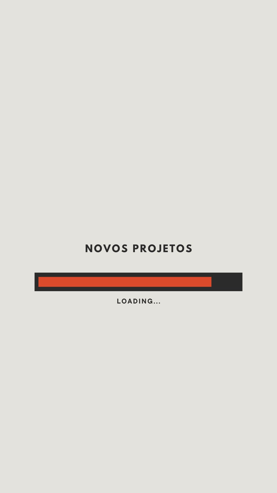

#Portifólio pessoal

#HTML

<!DOCTYPE html>
<html lang="pt-br">

<head>
    <meta charset="UTF-8">
    <meta name="viewport" content="width=device-width, initial-scale=1.0">
    <!--GOOGLE FONTS-->

    <link rel="preconnect" href="https://fonts.googleapis.com">
    <link rel="preconnect" href="https://fonts.gstatic.com" crossorigin>
    <link
        href="https://fonts.googleapis.com/css2?family=Poppins:ital,wght@0,100;0,200;0,300;0,400;0,500;0,600;0,700;0,800;0,900;1,100;1,200;1,300;1,400;1,500;1,600;1,700;1,800;1,900&display=swap"
        rel="stylesheet">
    <!--FIM GOOGLE FONTS-->

    <!--BOOTSTRAP ICONS-->
    <link rel="stylesheet" href="https://cdn.jsdelivr.net/npm/bootstrap-icons@1.11.3/font/bootstrap-icons.min.css">
    <!--FIM  BOOTSTRAP ICONS-->

    <title>Vyktor Nascimento</title>
    <link rel="shortcut icon" href="images/favicon_transparent_32x32.png" type="image/x-icon">
    <link rel="stylesheet" href="style.css">

</head>

<body>
    <header>
        

            

                
            
<!--fim logo-->

            <nav id="menu-desktop">
                <ul>
                    <li><a href="#">Home</a></li>
                    <li><a href="#">Sobre</a></li>
                    <li><a href="#">Especialidades</a></li>
                    <li><a href="#">Projetos</a></li>
                </ul>

            </nav>

            

                <a href="#">
                    <button>Contato</button>
                </a>

            

        
<!--fim da interface-->
    </header>

    <main>
        <section class="topo-do-site">
            

                

                    

                        <h1>CODANDO O FUTURO.</h1>
                        
"Qualquer tecnologia suficientemente avançada é indistinguível de magia."  - Arthur C.
                            Clarke

                    
<!--FIM txt-topo-site-->

                    

                        

                    
<!--FIM img-topo-site-->

                
<!-- FIM flex-->

            
<!--Fim Interface-->
        </section><!--FIM topo do site-->

        <section class="especialidades">
            

                <h2 class="titulo">MINHAS ESPECIALIDADES.</h2>

                

                    

                        <i class="bi bi-code-slash"></i>
                        <h3>Desenvolvimento</h3>
                        
 Me aventuro criando novos códigos nas linguagens que eu sei e aprendendo novas para realizar
                            as funções que eu preciso nas minhas aplicações.

                    
<!--FIM de especi-box-->

                    

                        <i class="bi bi-cpu"></i>
                        <h3>Lógica de programação</h3>
                        
Como programador, me amarro em resolver problemas na lógica dos algoritmos ou até mesmo
                            criiar do zero as demandas dos clientes.

                    
<!--FIM de especi-box-->

                    

                        <i class="bi bi-people"></i>
                        <h3>Marketing</h3>
                        
Com conhecimentos solidos em marketing digital e tráfego, possuo a capacidade de criar
                            narrativas que captam os usuários e prendem no conteúdo. 

                    
<!--FIM de especi-box-->
                
<!--FIM DE FLEX-->
            
<!--FIM DE INTERFACE-->
        </section><!--FIM DE ESPECIALIDADES-->

        <section class="sobre">
            

                

                    

                        

                    
<!---FIM IMG SOBRE--->

                    

                        <h2>MUITO PRAZER, SOU VYKTOR NASCIMENTO.</h2>
                        
Lorem ipsum dolor sit amet consectetur, adipisicing elit. Aliquid aperiam tempora mollitia,
                            explicabo, quos nesciunt iste at maxime, saepe fuga ea enim illo adipisci nisi ipsum
                            voluptas eveniet quo quasi?

                        
Lorem ipsum dolor sit, amet consectetur adipisicing elit. Explicabo, vitae excepturi error
                            eligendi aliquid quos. Quasi numquam recusandae aliquid asperiores, sapiente, ab libero
                            quaerat, ipsum natus aspernatur voluptate corporis non.

                        

                            <a href="https://www.instagram.com/vyktor_f?igsh=YTBlYW95dTdvaHVo"><button><i
                                        class="bi bi-instagram"></i></button></a>
                            <a href="https://www.linkedin.com/in/vyktor-nascimento"><button><i
                                        class="bi bi-linkedin"></i></button></a>
                        

                    
<!---FIM TXT SOBRE-->
                

            
<!---FIM Interface -->
        </section><!--Fim sobre-->

        <section class="portfolio">
            

                <h2 class="titulo">MEU PORTFÓLIO.</h2>

                

                   
                   
                   
                    <!--Quando tiver novos projetos, add aq as imagens-->
                
<!--Fim flex-->
            
<!--Fim de interface-->
        </section><!--FIm do portfolio-->
    </main>

    <footer>
        

            

                

                    

                        
                    

                    

                        <a href="https://www.instagram.com/vyktor_f?igsh=YTBlYW95dTdvaHVo"><button><i
                                    class="bi bi-instagram"></i></button></a>
                        <a href="https://www.linkedin.com/in/vyktor-nascimento"><button><i
                                    class="bi bi-linkedin"></i></button></a>
                    

                
 <!--Fim do flex-->
            
<!--Fim line footer-->

            

                
<i class="bi bi-envelope-fill"></i> <a href="mailto:vyktorf07@gmail.com">vyktorf07@gmail.com</a>

            
<!--Fim line footer-->
        
<!--Fim de interface-->
    </footer><!--Fim do footer-->
</body>
</html>

#CSS

  
*{
    margin: 0;
    padding:  0;
    box-sizing: border-box;
    font-family: "Poppins", sans-serif;

}

body{
    background-color: black;
    height: 100vh;
}

.interface{
    max-width: 1280px;
    margin: 0 auto;
}

.flex{
    display: flex;
}

h2.titulo{
    color: white;
    font-size: 34;
    text-align: center;
}
h2.titulo span{
    color: #01c38e;
}

/* ESTILO DO CABEÇALHO */

header{
    padding: 40px 4%;
}

header > .interface{
    display: flex;
    align-items: center;
    justify-content: space-between;
}
.logo{
    width: 250px;
}

header a{
    color: #5c5c5c;
    text-decoration: none;
    display: inline-block;
    transition: .2s;
}

header a:hover{
    color: #fff;
    transform: scale(1.05);
    
}

header nav ul{
    list-style-type: none;
}

header nav ul li{
    display: inline-block;
    padding: 0 40px;
}

header .btn-contato button{
    padding: 10px 40px;
    font-size: 18px;
    font-weight: 600;
    background-color: #01c38e;
    border: 0;
    border-radius: 30px;
    cursor: pointer;
}

/* Topo do site */
section.topo-do-site{
    padding: 40px 4%;
}
.img-topo-site{
    width: 250px;
}
section.topo-do-site .flex{
    align-items: center;
    justify-content: center;
    gap: 70px;
}
.topo-do-site h1{
    color: #fff;
    font-size: 34px;
    
}
.topo-do-site p{
    color: #fff;
    font-size: 16px;
    margin: 40px 0;
}

.topo-do-site .img-topo-site img{
    position: relative;
    animation: flutuar 2s ease-in-out infinite alternate;
}

@keyframes flutuar{
    0%{
        top:0;
    }
    100%{
        top: 30px;
    }
}
/*Fim do topo do site/*

/*Especialidades*/

section.especialidades{
   padding: 130px;
}

section.especialidades .flex{
    gap: 60px;
}

.especialidades .especialidades-box{
    color: #fff;
    padding: 40px;
    margin-top: 45px;
    border-radius: 20px;
    transition: .2s;
}
.especialidades .especialidades-box:hover{
    transform: scale(1.05);
    box-shadow: 0 0 20px #ffffff82;

}

.especialidades .especialidades-box i{
    font-size: 70px;
    color: #01c38e;
}

.especialidades .especialidades-box h3{
    font-size: 28;
    margin: 15px 0;
}

/*Estilo do sobre*/

section .sobre{
    padding: 40px 4%;
}

section .sobre .flex{
    align-items: center;
    gap: 60px;
}

.sobre .img-sobre img{
width: 350px;
padding: 30px;
border-radius: 50px;
}

.sobre .txt-sobre{
    color: #fff;
}

.sobre .txt-sobre h2{
    font-size: 40px;
    line-height: 40px;
    margin-bottom: 30px;
}
.sobre .txt-sobre h2 span{
    color: #01c38e;
    display: block;

}

.sobre .txt-sobre p{
    margin: 20px 0;
    text-align: justify;

}

.btn-social button{
    width: 70px;
    height: 70px;
    border-radius: 20px;
    margin: 0 8px;
    transition: .2s;
    cursor: pointer;
    background-color: #01c38e;
    font-size: 22px;
    justify-content: center;
}
.btn-social button:hover{
    box-shadow: 0px 0px 8px #01c38e;
    transform: scale(1.05);

}

/*ESTILO PORTFOLIO*/
section.portfolio{
    padding: 80px 4%;
    box-shadow: 0 0 40px 10px #ffffff38;
}
section.portfolio.flex{
    justify-content: space-around;

}

section.portfolio img{
    width: 360px;
    height: 460px;
    margin: 30px;
    background-size: cover;
    background-position: 100% 0%;
    border-radius: 15px;
}
.portfolio img:hover{
    transform: scale(1.05);
}

/* FOOTER */

footer{
    padding: 40px 4%;
}

footer img{
    width: 250px;
    height: 210px;
}
footer.logo-footer{
    justify-content: space-between;
}

.borda{
    border-top: 3px solid #01c38e;

}

footer .line-footer p i{
    color: #01c38e
}
footer .line-footer p a{
    color: #fff;
}
